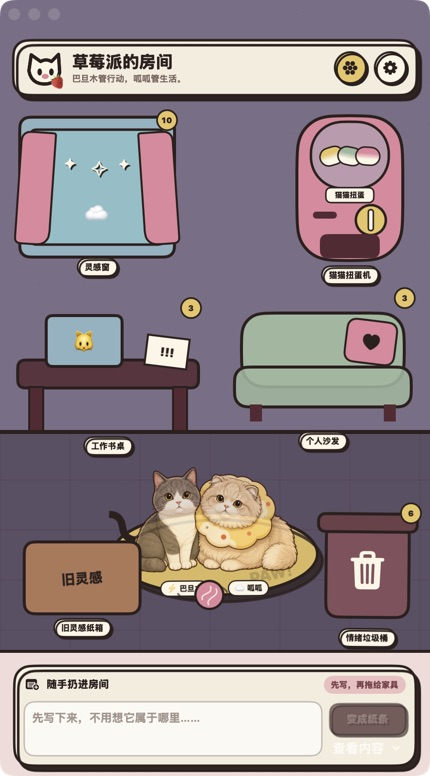

# 🍓 草莓派 StrawberryPie

> 第一次 Vibe Coding，给我家两只猫盖了一套桌面电子房子。

[](https://github.com/lanjiqiu92-cmyk/StrawberryPie/releases/latest)
[](Package.swift)
[](https://github.com/lanjiqiu92-cmyk/StrawberryPie/releases/latest)



**[下载最新版](https://github.com/lanjiqiu92-cmyk/StrawberryPie/releases/latest)** · macOS 14+ · 不配置 AI 也能正常使用

草莓派是一个 macOS 桌面小工具，可以随手记灵感、收工作待办、放个人提醒，也可以把坏情绪丢进垃圾桶。它不是严肃的效率系统，更像一间由两只猫值班的小房间。

- 灰白短毛猫 **巴旦木**：负责工作，擅长把废话压缩成下一步行动。
- 乳白长毛猫 **呱呱**：负责生活，提醒你喝水、上厕所、起来走走。

项目最早叫“巧克力派”，后来想到猫不能吃巧克力，于是紧急改名“草莓派”。源码中的部分 `ChocolatePie` 标识仍然保留，用于兼容旧版本的数据。

> 如果巴旦木和呱呱让你觉得有点可爱，欢迎给仓库点一颗 ⭐️。它们会把这理解成今日罐罐绩效。

## 现在能做什么

- 把随手写下的纸条拖进灵感窗、工作书桌、个人沙发或情绪垃圾桶
- 分开管理灵感、工作待办、个人待办和需要密码打开的情绪垃圾
- 完成任务时看猫猫放烟花
- 把坏情绪扔掉时触发一段很解气的电子仪式
- 用猫猫扭蛋机抽签，并导出 4:5 可爱卡片分享给朋友
- 自定义喝水、上厕所、走动和保护老腰的定时提醒
- 可选接入 DeepSeek、通义千问、Kimi 或 OpenAI 兼容接口
- 工作内容只在你主动点击后精简；生活内容只在你主动点击后改成温柔提醒

## 隐私说明

- 待办、灵感和设置保存在本机，不会提交到仓库。
- API Key 保存在 macOS 钥匙串，不会写入源码或 Git。
- AI 功能是可选项；不配置模型也可以使用基础功能。
- 只有你主动触发 AI 功能时，对应文字才会发送到你配置的模型服务商。

## 运行环境

- macOS 14 或更高版本
- Swift 6 工具链
- Xcode Command Line Tools

## 直接安装

前往 **[Releases](https://github.com/lanjiqiu92-cmyk/StrawberryPie/releases/latest)** 下载 `StrawberryPie-v2.1.0-macOS.zip` 或 `.dmg`。

当前安装包使用个人签名，macOS 首次打开时可能会进行安全确认。若系统拦截，请右键应用并选择“打开”。

## 本地运行

```bash
swift run
```

## 构建 macOS App

```bash
./scripts/build_app.sh
```

构建完成后，应用会出现在：

```text
dist/草莓派.app
```

当前构建脚本使用本机的 macOS 15.4 SDK 路径。如果你的 Command Line Tools 版本不同，请把 `scripts/build_app.sh` 中的 `SDKROOT` 改成自己电脑上实际存在的 SDK。

## AI 配置

打开应用右上角的设置，在 AI 服务中填写：

1. 服务商
2. API 地址
3. 模型名称
4. API Key

草莓派默认推荐 DeepSeek，但也支持 OpenAI 兼容格式的其他模型服务。Key 只会写入 macOS 钥匙串。

## 关于这个项目

这是我的第一个 Vibe Coding 小产品。很多人已经手搓了无数个 App，我才刚摸到门把手，但看到一个只存在于脑子里的小玩意真的跑起来，还是觉得很稀奇。

它当然不是一个多么了不起的大产品，甚至有些地方还有点傻，但巴旦木和呱呱已经正式上岗了。

---

Made with Vibe Coding、两只猫，以及一点“我就想要这个”的执念。
